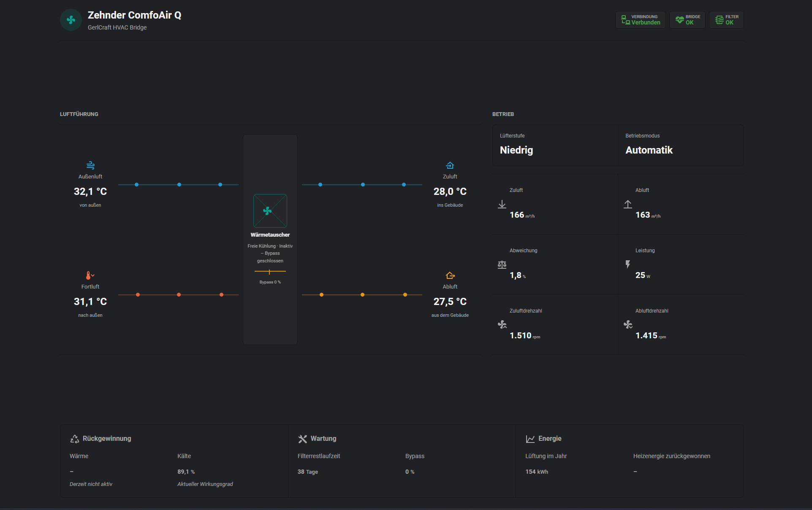

# GerlCraft Zehnder Card

Die Karte zeigt die Zehnder ComfoAir Q als zusammenhaengende, animierte
Anlagenansicht. Sie verwendet die von der Bridge per MQTT Discovery angelegten
Home-Assistant-Entitaeten. Ab Kartenversion 1.0.11 kann der auf 60 Minuten
begrenzte Boost direkt unter der Bypass-Anzeige gestartet und vorzeitig beendet
werden. Andere Anlagenfunktionen bleiben reine Anzeigen.

## Vorschau



## Installation

1. Die Datei `gerlcraft-zehnder-card.js` nach
   `/config/www/gerlcraft-zehnder-card.js` kopieren.
2. Home Assistant oeffnen und
   `Einstellungen > Dashboards > Drei-Punkte-Menue > Ressourcen` aufrufen.
3. Eine JavaScript-Modulressource hinzufuegen:

   ```text
   /local/gerlcraft-zehnder-card.js?v=1.0.15
   ```

4. Das vorhandene Dashboard im Raw-Konfigurationseditor oeffnen.
5. Den Inhalt von `../view-custom-card.yaml` am Ende der vorhandenen
   `views:`-Liste einfuegen.
6. Speichern und den Browser einmal vollstaendig neu laden.

Die neue Seite erscheint als Reiter `Zehnder` unter dem URL-Pfad
`zehnder-card`.

## Alternative Entity-Praefixe

Die Karte sucht den Entity-Praefix automatisch ueber den
Zuluftvolumenstrom-Sensor. Falls mehrere Zehnder-Bridges vorhanden sind, kann
der gewuenschte Praefix explizit gesetzt werden:

```yaml
type: custom:gerlcraft-zehnder-card
title: Zehnder ComfoAir Q
entity_prefix: zehnder_comfoair_q350
humidity_entity: sensor.shelly_blu_h_t_zb_luftfeuchtigkeit
humidity_warning_threshold: 65
boost_entity: switch.gerlcraft_zehnder_bridge_boost
boost_remaining_entity: sensor.gerlcraft_zehnder_bridge_boost_restzeit
```

Einzelne Entity-IDs koennen bei Bedarf ebenfalls ueberschrieben werden:

```yaml
type: custom:gerlcraft-zehnder-card
entities:
  supplyFlow: sensor.meine_zuluft
  extractFlow: sensor.meine_abluft
  boost: switch.mein_zehnder_boost
  boostRemaining: sensor.meine_zehnder_boost_restzeit
```

Ohne Ueberschreibung erkennt die Karte sowohl
`switch.gerlcraft_zehnder_bridge_boost` als auch den praefixbasierten Namen
`switch.zehnder_comfoair_q350_boost`. Der Schalter wird ab Bridge-Firmware
1.1.0 per MQTT Discovery bereitgestellt. Ab Firmware 1.1.1 zeigt die Card die
von der Q350 gemeldete echte Boost-Restzeit an. Mit Firmware 1.1.0 verwendet
sie ersatzweise den bereits vorhandenen Sensor fuer den naechsten Wechsel der
Luefterstufe.

## Optionaler Feuchtesensor

Ein Feuchtesensor aus Home Assistant kann als zusaetzliches Statusfeld
angezeigt werden. Fuer den Shelly BLU H&T ZB aus dem Node-RED-Beispiel ist
normalerweise diese Konfiguration passend:

```yaml
type: custom:gerlcraft-zehnder-card
title: Zehnder ComfoAir Q
humidity_entity: sensor.shelly_blu_h_t_zb_luftfeuchtigkeit
humidity_warning_threshold: 65
```

Unterhalb der Warnschwelle ist das Feld gruen. Ab der konfigurierten Schwelle
wird es gelb dargestellt. Ist der konfigurierte Sensor nicht erreichbar,
erscheint das Feld rot mit dem Zustand `Offline`.

Die Einbindung des Sensors und der automatische Bad-Boost per Node-RED sind in
[`../node-red/README.md`](../node-red/README.md) beschrieben.

## Aktualisierung

Bei einer neuen Version die JavaScript-Datei ersetzen und die Versionsnummer
in der Ressourcen-URL erhoehen. Danach den Browser neu laden. Die geaenderte
URL verhindert, dass der Browser eine alte Kartenversion aus dem Cache nutzt.
